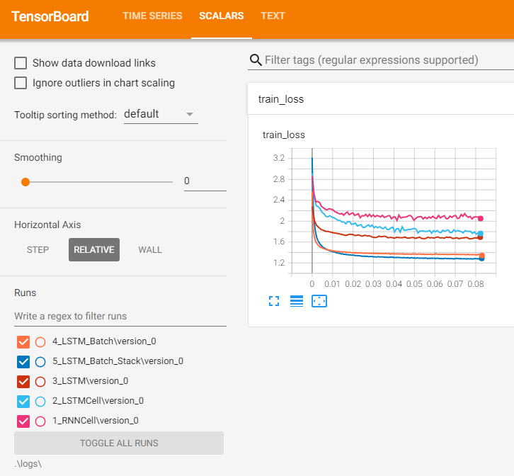
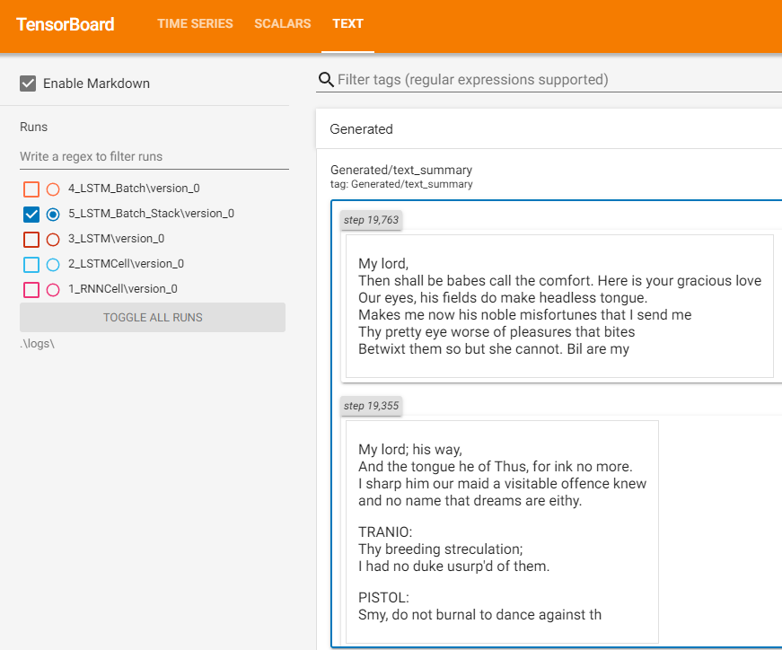

# Character-level generation 
Step-by-step experiments of character-level language modelling starting from RNNCell, finalized with Stacked LSTM.
Used PyTorch and PyTorch Lightning for training and testing.  
The RNN is trained to predict next letter in a given text sequence. The trained model can then be used to generate a new text sequence resembling the original data.  
Tensorboard is used for logging the training process and observing the improvement in the generated text.

## Requirements
Trained and tested on:

* Python 3.12
* numpy==1.26.4
* pytorch-lightning==2.3.3
* tensorboard==2.17.0
* torch==2.2.2+cu118

## Usage
### Setup
* Clone the repository.
* Install the required packages by running `pip install -r requirements_cuda.txt`.

### Training
* Change directory to the cloned repository.
* Each experiment is in a separate directory starting from 1_***.
* Each experiment directory contains a `main.py` file which is the entry point for the experiment. File contains the detailed explanation of the experiment.
* Run an experiment like `python 1_RNNCell\main.py` in the cloned directory.

### Configuration&Logging
* The `params.yml` file in each experiment directory contains the hyperparameters and configuration for the experiment. These paramaters are for PyTorch modules, PyTorch Lightning Trainer, the dataset, inference, logging and inference etc.
* During training process, logs are saved in the `logs` directory with specific folders for each experiment.
* To visualize the training process, run `tensorboard.exe --logdir logs` in the cloned directory and open the link in a browser.

## Results
* In the default configuration via `params.yml`, the model is trained on the `data/shakespeare.txt` file and limited to 5 minuutes of runtime.
* The `train_loss` graph shows the progress and final value of the loss reached in 5 minutes for each experiment.

* We can also observe the generated text in the tensorboard.
